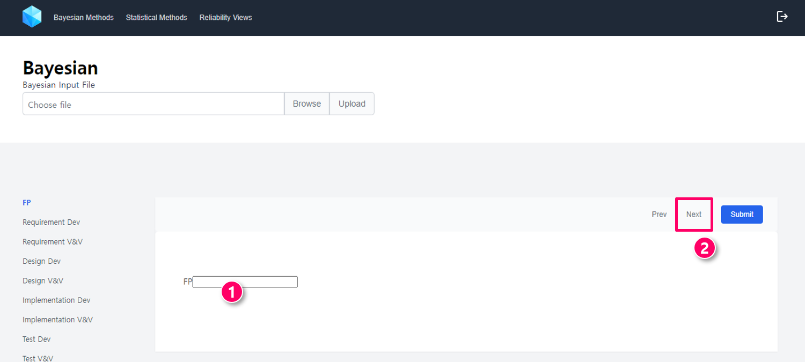
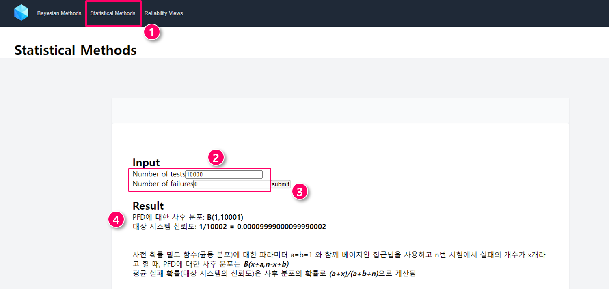
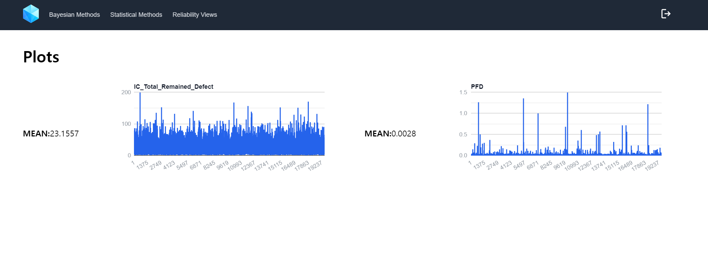

# User Manual
PLCSoftRel is a web application for reliability measurement for PLC software based on Bayesian models and statistical testing. This manual describes how to use PLCSoftRel to estimate the reliability of PLC software.

## Getting Started
1. [Sign up to create a PLCSoftRel account](#sign-up-to-create-a-plcsoftrel-account)
2. [Sign in to PLCSoftRel](#sign-in-to-plcsoftrel)
3. [Submit activity evaluation results for Bayesian Method](#submit-activity-evaluation-results-for-bayesian-method)
4. [Submit test results for Statistical Method](#submit-test-results-for-statistical-method)
5. [View reliability results](#view-reliability-results)

## Sign up to create a PLCSoftRel account
Open the **PLCSoftRel** app and click the button in the top-right corner.

The sign-in page will appear. Click the **Sign Up** button.

This will guide you to the sign-up page. Enter your **Email Address** and **Password** and then click the **Sign Up** button to complete the registration.

## Sign in to PLCSoftRel
Open the **PLCSoftRel** app and click the button in the top-right corner.

This will guide you to the sign-in page. Enter your **Email Address** and **Password** and then click the **Sign In** button to access your account.

## Submit activity evaluation results for Bayesian Method
Click the **Bayesian Methods** tab to start entering software-specific information including the **Number of Function Points (FP)** and **Development and V&V Activity Evaluation Results**.

### Number of Function Points (FP)
The number of Function Points (FP) is a measure of the software’s size and complexity. To estimate the number of FPs, please refer to **Table 8-10 "Ratios of Source-code Statements to Function Points for Selected Programming Languages"** in the **U.S.NRC report [1]**.

1. Enter the **Number of FPs**
2. Click the **Next** button to proceed.

### Development and V&V activity evaluation results
To proceed development and V&V activity evaluation, please refer to **Section 4.2.1 "Attribute Nodes"** and **Appendix B "Detailed Attributes of All Phases"** in the **U.S.NRC report [1]**.

> Activity Quality is represented by 3 states: "High", "Medium", and "Low".
1. Enter the activity qualities by drop-down list.
2. Click the **Prev** and **Next** button to go to the previous/next section.
3. After you finish entering the data, click the **Submit** button to submit your results.

## Submit test results for Statistical Method
1. Enter the **number of executed tests** and the **number of failures**
2. Click the **submit** button to obtain the estimated reliability.
3. View the estimated reliability using statistical testing.

## View reliability results
After submitting the results, you can view the estimated reliability results, specifically the **mean** values and **Markov chain Monte Carlo (MCMC) simulation traces** of the following reliability metrics:

- Probability of Failure on Demand (PFD): probablity that safety software failed to take action when the demand condition is satisfied
    - Demand is a plant condition that requires the actuation of safety systems
    - Eg. demand in reactor protection system: the condition that the trip signal should be produced

- Number of remaining faults

<!-- ## Accounts
### Authority
- Reviewers
- Users -->

## References
1. Chu T.-L., Varuttamaseni A., Yue M., Lee S. J., Kang H. G., Cho J., & Yang S. (2018). Developing a Bayesian Belief Network Model for Quantifying the Probability of Software Failure of a Protection System (NUREG CR-7233). U.S. NRC.
